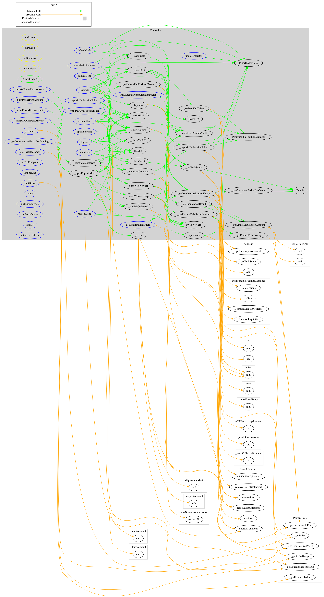
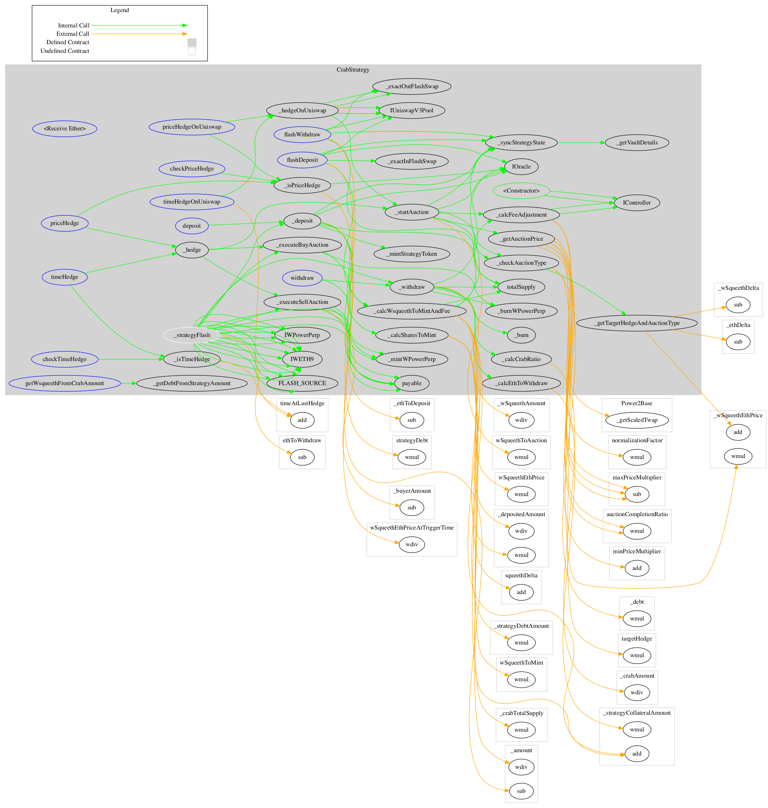
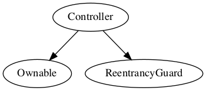
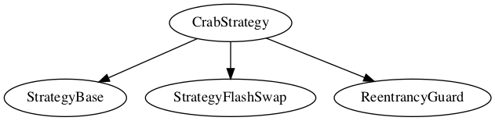

<div id="splash">
    <div id="project">
          <span class="splash-title">
               Project
          </span>
          <br />
          <span id="project-value">
               Opyn Squeeth
          </span>
    </div>
     <div id="details">
          <div id="left">
               <span class="splash-title">
                    Client
               </span>
               <br />
               <span class="details-value">
                    Opyn
               </span>
               <br />
               <span class="splash-title">
                    Date
               </span>
               <br />
               <span class="details-value">
                    December 2021
               </span>
          </div>
          <div id="right">
               <span class="splash-title">
                    Reviewers
               </span>
               <br />
               <span class="details-value">
                    Andrei Simion
               </span><br />
               <span class="contact">@andreiashu</span>
               <br />
               <span class="details-value">
                    Daniel Luca
               </span><br />
               <span class="contact">@cleanunicorn</span>
          </div>
    </div>
</div>


## Table of Contents
 - [Details](#details)
 - [Issues Summary](#issues-summary)
 - [Executive summary](#executive-summary)
     - [Week 1](#week-1)
     - [Week 2](#week-2)
 - [Scope](#scope)
 - [Issues](#issues)
     - [EIP-721 standard is not implemented correctly; can lead to loss of funds for users;](#eip-721-standard-is-not-implemented-correctly-can-lead-to-loss-of-funds-for-users)
 - [Artifacts](#artifacts)
     - [Surya](#surya)
     - [Sūrya's Description Report](#suryas-description-report)
     - [Files Description Table](#files-description-table)
     - [Contracts Description Table](#contracts-description-table)
     - [Legend](#legend)
     - [Tests](#tests)
 - [License](#license)


## Details

- **Client** Opyn
- **Date** December 2021
- **Lead reviewer** Andrei Simion ([@andreiashu](https://twitter.com/andreiashu))
- **Reviewers** Daniel Luca ([@cleanunicorn](https://twitter.com/cleanunicorn)), Andrei Simion ([@andreiashu](https://twitter.com/andreiashu))
- **Repository**: [Opyn Squeeth](git@github.com:opynfinance/squeeth-monorepo.git)
- **Commit hash** `474413cbba52708c953a23a500acc4194735c87b`
- **Technologies**
  - Solidity
  - Typescript

## Issues Summary

| SEVERITY       |    OPEN    |    CLOSED    |
|----------------|:----------:|:------------:|
|  Informational  |  0  |  0  |
|  Minor  |  0  |  0  |
|  Medium  |  0  |  0  |
|  Major  |  0  |  1  |

## Executive summary

This report represents the results of the engagement with **Opyn** to review **Opyn Squeeth**.

The review was conducted over the course of **2 weeks** from **November 29 to December 10, 2021**. A total of **15 person-days** were spent reviewing the code.

The code is well written, and the design is thoroughly thought out. There are unit and integration tests, and the code is gas efficient.

The team has been very helpful in guiding our understanding of the design and its implementation - especially since some of the constructs are somewhat novel in the crypto space.

### Week 1

We started by reviewing the provided documentation and the initial kickoff recording during the first week.

Within the first few days of the review, we identified an issue with the way `ERC721` tokens are handled and raised it with the team.

It became clear that this issue had been identified in a previous code review by the ToB team, and we were given access to their report.

### Week 2

We kept close contact with the Squeeth team on an almost daily basis. We went through the mechanics for funding rate, vault liquidations, the incentives that will keep the Mark Price within certain bounds relative to Index, Crab Strategy, and different parameters for the funding period.

In the second week we reviewied patches that addressed some of the issues that were found in the code (by us and previously by ToB team).

We expressed our concerns to the team regarding the financial constructs involved in the Squeeth product - we recommend seeking further review of the code and high-level mechanics from a third party that is specialized in this area. While the code might be correct from a security standpoint, we cannot guarantee that the game-theoretical model is going to perform as predicted in all conditions.

## Scope

The initial review focused on the [Opyn Squeeth](git@github.com:opynfinance/squeeth-monorepo.git) repository, identified by the commit hash `474413cbba52708c953a23a500acc4194735c87b`.

We focused on manually reviewing the codebase, searching for security issues such as, but not limited to, re-entrancy problems, transaction ordering, block timestamp dependency, exception handling, call stack depth limitation, integer overflow/underflow, self-destructible contracts, unsecured balance, use of origin, costly gas patterns, architectural problems, code readability.

**Includes:**

 - packages/hardhat/contracts/core/Controller.sol
 - packages/hardhat/contracts/core/Oracle.sol
 - packages/hardhat/contracts/core/WPowerPerp.sol
 - packages/hardhat/contracts/core/ShortPowerPerp.sol
 - packages/hardhat/contracts/periphery/ShortHelper.sol
 - packages/hardhat/contracts/libs/Power2Base.sol
 - packages/hardhat/contracts/libs/Uint256Casting.sol
 - packages/hardhat/contracts/libs/ABDKMath64x64.sol
 - packages/hardhat/contracts/libs/VaultLib.sol
 - packages/hardhat/contracts/libs/OracleLibrary.sol
 - packages/hardhat/contracts/external/WETH9.sol
 - packages/hardhat/contracts/import/Uni.sol
 - packages/hardhat/contracts/interfaces/IWETH9.sol
 - packages/hardhat/contracts/interfaces/IWPowerPerp.sol
 - packages/hardhat/contracts/interfaces/IOracle.sol
 - packages/hardhat/contracts/interfaces/IERC20Detailed.sol
 - packages/hardhat/contracts/interfaces/IShortPowerPerp.sol
 - packages/hardhat/contracts/interfaces/IController.sol
 - packages/hardhat/contracts/strategy/CrabStrategy.sol
 - packages/hardhat/contracts/strategy/base/StrategyFlashSwap.sol
 - packages/hardhat/contracts/strategy/base/StrategyBase.sol
 - packages/hardhat/contracts/strategy/base/StrategyMath.sol


## Issues


### [EIP-721 standard is not implemented correctly; can lead to loss of funds for users;](https://github.com/akiratechhq/review-opyn-squeeth-2021-11/issues/1)
 

**Description**

Edit: issue fixed in [opynfinance/squeeth-monorepo#630](https://github.com/opynfinance/squeeth-monorepo/pull/630).

The `ShortPowerPerp` contract is used to generate an NFT, which represents the user's ownership of a vault within the Squeeth platform:


[code/packages/hardhat/contracts/core/ShortPowerPerp.sol#L38-L46](https://github.com/akiratechhq/review-opyn-squeeth-2021-11/blob/334d87dd005336f60b0e9a767f16910b076e404e/code/packages/hardhat/contracts/core/ShortPowerPerp.sol#L38-L46)
```solidity
    /**
     * @notice mint new NFT
     * @dev autoincrement tokenId starts at 1
     * @param _recipient recipient address for NFT
     */
    function mintNFT(address _recipient) external onlyController returns (uint256 tokenId) {
        // mint NFT
        _mint(_recipient, (tokenId = nextId++));
    }
```

The issue is that the function uses OpenZeppelin's `ERC721._mint` function instead of `_safeMint`. The difference between these two functions is that `_safeMint` ensures that the `onERC721Received` function is called on the destination address to handle the receipt of the NFT (for non-contract addresses this is a no-op):

```solidity
    /**
     * @dev Same as {xref-ERC721-_safeMint-address-uint256-}[`_safeMint`], with an additional `data` parameter which is
     * forwarded in {IERC721Receiver-onERC721Received} to contract recipients.
     */
    function _safeMint(address to, uint256 tokenId, bytes memory _data) internal virtual {
        _mint(to, tokenId);
        require(_checkOnERC721Received(address(0), to, tokenId, _data), "ERC721: transfer to non ERC721Receiver implementer");
    }
```

When transferring Uniswap V3 LP tokens, since they implement the EIP-721 standard, the `safeTransferFrom` function should be called instead (the `NonfungiblePositionManager` contract extends OpenZeppeling's `EIP721` contract):


[code/packages/hardhat/contracts/core/Controller.sol#L800](https://github.com/akiratechhq/review-opyn-squeeth-2021-11/blob/334d87dd005336f60b0e9a767f16910b076e404e/code/packages/hardhat/contracts/core/Controller.sol#L800)
```solidity
        INonfungiblePositionManager(uniswapPositionManager).transferFrom(_account, address(this), _uniTokenId);
```

A user can deposit Uniswap V3 LP positions as collateral in a vault by calling `Controller.depositUniPositionToken`:


[code/packages/hardhat/contracts/core/Controller.sol#L344](https://github.com/akiratechhq/review-opyn-squeeth-2021-11/blob/334d87dd005336f60b0e9a767f16910b076e404e/code/packages/hardhat/contracts/core/Controller.sol#L344)
```solidity
    function depositUniPositionToken(uint256 _vaultId, uint256 _uniTokenId) external notPaused nonReentrant {
```

According to the [EIP-721 specification](https://eips.ethereum.org/EIPS/eip-721#specification) a contract that receives NFT tokens should implement the `onERC721Received` function:

```solidity
/// @dev Note: the ERC-165 identifier for this interface is 0x150b7a02.
interface ERC721TokenReceiver {
    /// @notice Handle the receipt of an NFT
    /// @dev The ERC721 smart contract calls this function on the recipient
    ///  after a `transfer`. This function MAY throw to revert and reject the
    ///  transfer. Return of other than the magic value MUST result in the
    ///  transaction being reverted.
    ///  Note: the contract address is always the message sender.
    /// @param _operator The address which called `safeTransferFrom` function
    /// @param _from The address which previously owned the token
    /// @param _tokenId The NFT identifier which is being transferred
    /// @param _data Additional data with no specified format
    /// @return `bytes4(keccak256("onERC721Received(address,address,uint256,bytes)"))`
    ///  unless throwing
    function onERC721Received(address _operator, address _from, uint256 _tokenId, bytes _data) external returns(bytes4);
}
```

**References**

[EIP-721 specification](https://eips.ethereum.org/EIPS/eip-721#specification)


---


## Artifacts

### Surya

Sūrya is a utility tool for smart contract systems. It provides a number of visual outputs and information about the structure of smart contracts. It also supports querying the function call graph in multiple ways to aid in the manual inspection and control flow analysis of contracts.

### Sūrya's Description Report

### Files Description Table


|  File Name  |  SHA-1 Hash  |
|-------------|--------------|
| code/packages/hardhat/contracts/core/Controller.sol | c9b7623dc1c6be03b9215514954993fb897fa02d |
| code/packages/hardhat/contracts/core/Oracle.sol | 5e5c129114521d1c9062e610a534b48596cb92bb |
| code/packages/hardhat/contracts/core/ShortPowerPerp.sol | 748ece1c47274a9c79f1fa66cf33c60b433d2dd7 |
| code/packages/hardhat/contracts/core/WPowerPerp.sol | c3beb4844213cca1b471bc2989cef4a753055d26 |
| code/packages/hardhat/contracts/external/WETH9.sol | 6a93c6c5baf98e8923d485dbd5f2346fd72ee4ec |
| code/packages/hardhat/contracts/import/Uni.sol | 252b195115988472905100d43ed1e1673be961d9 |
| code/packages/hardhat/contracts/interfaces/IController.sol | d6d01a0ccfdbd2cff36d40f87337f59991c6c5fb |
| code/packages/hardhat/contracts/interfaces/IERC20Detailed.sol | b9a4037e3b33da4487c54347d589faf1e75e14bc |
| code/packages/hardhat/contracts/interfaces/IOracle.sol | 2f4f6a90b16ae4bd43ea54803eb4825cff62503d |
| code/packages/hardhat/contracts/interfaces/IShortPowerPerp.sol | b3981690bd6376030a2892600dbeb09d12b15ada |
| code/packages/hardhat/contracts/interfaces/IWETH9.sol | b363e7995b3cee76aa9c28fee3e80dbe2d38c5ea |
| code/packages/hardhat/contracts/interfaces/IWPowerPerp.sol | dc73dda5c13111c1983d22a5e5b7e5759c2513e9 |
| code/packages/hardhat/contracts/libs/ABDKMath64x64.sol | 84f69ee125b5a9ea07cd8d2354c79af41e7b9b3b |
| code/packages/hardhat/contracts/libs/OracleLibrary.sol | d8f077a1f554eff6206c4555d136a422e116e6b8 |
| code/packages/hardhat/contracts/libs/Power2Base.sol | 79bfaaaa3596eb8fbdab663c2a069fab124cc667 |
| code/packages/hardhat/contracts/libs/Uint256Casting.sol | 0f53355e4e4fd4f2c5a26e01ceb0e3b64f670d4f |
| code/packages/hardhat/contracts/libs/VaultLib.sol | 99add4f6af3d001b5428f2083a782397b30fcd50 |
| code/packages/hardhat/contracts/periphery/ShortHelper.sol | 444058180fbb9d6eb7202df88106488b4993232b |
| code/packages/hardhat/contracts/strategy/CrabStrategy.sol | bb1b91698205c22d992ebcb8fc2fc7594792436b |


### Contracts Description Table


|  Contract  |         Type        |       Bases      |                  |                 |
|:----------:|:-------------------:|:----------------:|:----------------:|:---------------:|
|     └      |  **Function Name**  |  **Visibility**  |  **Mutability**  |  **Modifiers**  |
||||||
| **Controller** | Implementation | Ownable, ReentrancyGuard |||
| └ | <Constructor> | Public ❗️ | 🛑  |NO❗️ |
| └ | getExpectedNormalizationFactor | External ❗️ |   |NO❗️ |
| └ | getIndex | External ❗️ |   |NO❗️ |
| └ | getUnscaledIndex | External ❗️ |   |NO❗️ |
| └ | getDenormalizedMark | External ❗️ |   |NO❗️ |
| └ | getDenormalizedMarkForFunding | External ❗️ |   |NO❗️ |
| └ | isVaultSafe | External ❗️ |   |NO❗️ |
| └ | mintPowerPerpAmount | External ❗️ |  💵 | notPaused nonReentrant |
| └ | mintWPowerPerpAmount | External ❗️ |  💵 | notPaused nonReentrant |
| └ | deposit | External ❗️ |  💵 | notPaused nonReentrant |
| └ | depositUniPositionToken | External ❗️ | 🛑  | notPaused nonReentrant |
| └ | withdraw | External ❗️ | 🛑  | notPaused nonReentrant |
| └ | withdrawUniPositionToken | External ❗️ | 🛑  | notPaused nonReentrant |
| └ | burnWPowerPerpAmount | External ❗️ | 🛑  | notPaused nonReentrant |
| └ | burnPowerPerpAmount | External ❗️ | 🛑  | notPaused nonReentrant |
| └ | reduceDebtShutdown | External ❗️ | 🛑  | isShutdown nonReentrant |
| └ | reduceDebt | External ❗️ | 🛑  | notPaused nonReentrant |
| └ | liquidate | External ❗️ | 🛑  | notPaused nonReentrant |
| └ | updateOperator | External ❗️ | 🛑  |NO❗️ |
| └ | setFeeRecipient | External ❗️ | 🛑  | onlyOwner |
| └ | setFeeRate | External ❗️ | 🛑  | onlyOwner |
| └ | shutDown | External ❗️ | 🛑  | onlyOwner notShutdown |
| └ | pause | External ❗️ | 🛑  | onlyOwner notShutdown notPaused |
| └ | unPauseAnyone | External ❗️ | 🛑  | isPaused notShutdown |
| └ | unPauseOwner | External ❗️ | 🛑  | onlyOwner isPaused notShutdown |
| └ | redeemLong | External ❗️ | 🛑  | isShutdown nonReentrant |
| └ | redeemShort | External ❗️ | 🛑  | isShutdown nonReentrant |
| └ | applyFunding | External ❗️ | 🛑  | notPaused |
| └ | donate | External ❗️ |  💵 | isShutdown |
| └ | <Receive Ether> | External ❗️ |  💵 |NO❗️ |
| └ | _checkVaultId | Internal 🔒 |   | |
| └ | _checkCanModifyVault | Internal 🔒 |   | |
| └ | _openDepositMint | Internal 🔒 | 🛑  | |
| └ | _burnAndWithdraw | Internal 🔒 | 🛑  | |
| └ | _openVault | Internal 🔒 | 🛑  | |
| └ | _depositUniPositionToken | Internal 🔒 | 🛑  | |
| └ | _addEthCollateral | Internal 🔒 | 🛑  | |
| └ | _withdrawUniPositionToken | Internal 🔒 | 🛑  | |
| └ | _withdrawCollateral | Internal 🔒 | 🛑  | |
| └ | _mintWPowerPerp | Internal 🔒 | 🛑  | |
| └ | _burnWPowerPerp | Internal 🔒 | 🛑  | |
| └ | _liquidate | Internal 🔒 | 🛑  | |
| └ | _reduceDebt | Internal 🔒 | 🛑  | |
| └ | _getFee | Internal 🔒 |   | |
| └ | _writeVault | Private 🔐 | 🛑  | |
| └ | _redeemUniToken | Internal 🔒 | 🛑  | |
| └ | _applyFunding | Internal 🔒 | 🛑  | |
| └ | _getNewNormalizationFactor | Internal 🔒 |   | |
| └ | _checkVault | Internal 🔒 |   | |
| └ | _isVaultSafe | Internal 🔒 |   | |
| └ | _getVaultStatus | Internal 🔒 |   | |
| └ | _getReduceDebtResultInVault | Internal 🔒 |   | |
| └ | _getReduceDebtBounty | Internal 🔒 |   | |
| └ | _getLiquidationResult | Internal 🔒 |   | |
| └ | _getSingleLiquidationAmount | Internal 🔒 |   | |
| └ | _getConsistentPeriodForOracle | Internal 🔒 |   | |
||||||
| **Oracle** | Implementation |  |||
| └ | getTwap | External ❗️ |   |NO❗️ |
| └ | getHistoricalTwap | External ❗️ |   |NO❗️ |
| └ | getMaxPeriod | External ❗️ |   |NO❗️ |
| └ | getTimeWeightedAverageTickSafe | External ❗️ |   |NO❗️ |
| └ | _fetchTwap | Internal 🔒 |   | |
| └ | _fetchRawTwap | Internal 🔒 |   | |
| └ | _fetchHistoricTwap | Internal 🔒 |   | |
| └ | _getMaxPeriod | Internal 🔒 |   | |
||||||
| **ShortPowerPerp** | Implementation | ERC721, Initializable |||
| └ | <Constructor> | Public ❗️ | 🛑  | ERC721 |
| └ | init | Public ❗️ | 🛑  | initializer |
| └ | mintNFT | External ❗️ | 🛑  | onlyController |
||||||
| **WPowerPerp** | Implementation | ERC20, Initializable, IWPowerPerp |||
| └ | <Constructor> | Public ❗️ | 🛑  | ERC20 |
| └ | init | External ❗️ | 🛑  | initializer |
| └ | mint | External ❗️ | 🛑  | onlyController |
| └ | burn | External ❗️ | 🛑  | onlyController |
||||||
| **WETH9** | Implementation |  |||
| └ | deposit | Public ❗️ |  💵 |NO❗️ |
| └ | withdraw | Public ❗️ | 🛑  |NO❗️ |
| └ | totalSupply | Public ❗️ |   |NO❗️ |
| └ | approve | Public ❗️ | 🛑  |NO❗️ |
| └ | transfer | Public ❗️ | 🛑  |NO❗️ |
| └ | transferFrom | Public ❗️ | 🛑  |NO❗️ |
||||||
| **Uni** | Implementation |  |||
||||||
| **IController** | Interface |  |||
| └ | ethQuoteCurrencyPool | External ❗️ |   |NO❗️ |
| └ | feeRate | External ❗️ |   |NO❗️ |
| └ | getFee | External ❗️ |   |NO❗️ |
| └ | quoteCurrency | External ❗️ |   |NO❗️ |
| └ | vaults | External ❗️ |   |NO❗️ |
| └ | shortPowerPerp | External ❗️ |   |NO❗️ |
| └ | wPowerPerp | External ❗️ |   |NO❗️ |
| └ | getExpectedNormalizationFactor | External ❗️ |   |NO❗️ |
| └ | mintPowerPerpAmount | External ❗️ |  💵 |NO❗️ |
| └ | mintWPowerPerpAmount | External ❗️ |  💵 |NO❗️ |
| └ | deposit | External ❗️ |  💵 |NO❗️ |
| └ | withdraw | External ❗️ |  💵 |NO❗️ |
| └ | burnWPowerPerpAmount | External ❗️ | 🛑  |NO❗️ |
| └ | burnOnPowerPerpAmount | External ❗️ | 🛑  |NO❗️ |
| └ | liquidate | External ❗️ | 🛑  |NO❗️ |
| └ | applyFunding | External ❗️ | 🛑  |NO❗️ |
| └ | reduceDebtShutdown | External ❗️ | 🛑  |NO❗️ |
||||||
| **IERC20Detailed** | Interface | IERC20 |||
| └ | decimals | External ❗️ |   |NO❗️ |
||||||
| **IOracle** | Interface |  |||
| └ | getHistoricalTwap | External ❗️ |   |NO❗️ |
| └ | getTwap | External ❗️ |   |NO❗️ |
| └ | getMaxPeriod | External ❗️ |   |NO❗️ |
| └ | getTimeWeightedAverageTickSafe | External ❗️ |   |NO❗️ |
||||||
| **IShortPowerPerp** | Interface | IERC721 |||
| └ | nextId | External ❗️ |   |NO❗️ |
| └ | mintNFT | External ❗️ | 🛑  |NO❗️ |
||||||
| **IWETH9** | Interface | IERC20 |||
| └ | deposit | External ❗️ |  💵 |NO❗️ |
| └ | withdraw | External ❗️ | 🛑  |NO❗️ |
||||||
| **IWPowerPerp** | Interface | IERC20 |||
| └ | mint | External ❗️ | 🛑  |NO❗️ |
| └ | burn | External ❗️ | 🛑  |NO❗️ |
||||||
| **ABDKMath64x64** | Library |  |||
| └ | mul | Internal 🔒 |   | |
| └ | mulu | Internal 🔒 |   | |
| └ | divu | Public ❗️ |   |NO❗️ |
| └ | log_2 | Public ❗️ |   |NO❗️ |
| └ | exp_2 | Public ❗️ |   |NO❗️ |
| └ | divuu | Private 🔐 |   | |
||||||
| **OracleLibrary** | Library |  |||
| └ | consultAtHistoricTime | Internal 🔒 |   | |
| └ | getQuoteAtTick | Internal 🔒 |   | |
||||||
| **Power2Base** | Library |  |||
| └ | _getIndex | Internal 🔒 |   | |
| └ | _getUnscaledIndex | Internal 🔒 |   | |
| └ | _getDenormalizedMark | Internal 🔒 |   | |
| └ | _getDebtValueInEth | Internal 🔒 |   | |
| └ | _getScaledTwap | Internal 🔒 |   | |
| └ | _getTwap | Internal 🔒 |   | |
| └ | _getLongSettlementValue | Internal 🔒 |   | |
||||||
| **Uint256Casting** | Library |  |||
| └ | toUint128 | Internal 🔒 |   | |
| └ | toUint96 | Internal 🔒 |   | |
| └ | toUint32 | Internal 🔒 |   | |
||||||
| **VaultLib** | Library |  |||
| └ | addEthCollateral | Internal 🔒 |   | |
| └ | addUniNftCollateral | Internal 🔒 |   | |
| └ | removeEthCollateral | Internal 🔒 |   | |
| └ | removeUniNftCollateral | Internal 🔒 |   | |
| └ | addShort | Internal 🔒 |   | |
| └ | removeShort | Internal 🔒 |   | |
| └ | getVaultStatus | Internal 🔒 |   | |
| └ | _getEffectiveCollateral | Internal 🔒 |   | |
| └ | _getUniPositionBalances | Internal 🔒 |   | |
| └ | _getUniswapPositionInfo | Internal 🔒 |   | |
| └ | _getToken0Token1Balances | Internal 🔒 |   | |
||||||
| **ShortHelper** | Implementation |  |||
| └ | <Constructor> | Public ❗️ | 🛑  |NO❗️ |
| └ | openShort | External ❗️ |  💵 |NO❗️ |
| └ | closeShort | External ❗️ |  💵 |NO❗️ |
| └ | <Receive Ether> | External ❗️ |  💵 |NO❗️ |
||||||
| **CrabStrategy** | Implementation | StrategyBase, StrategyFlashSwap, ReentrancyGuard |||
| └ | <Constructor> | Public ❗️ | 🛑  | StrategyBase StrategyFlashSwap |
| └ | <Receive Ether> | External ❗️ |  💵 |NO❗️ |
| └ | flashDeposit | External ❗️ |  💵 | nonReentrant |
| └ | flashWithdraw | External ❗️ | 🛑  | nonReentrant |
| └ | deposit | External ❗️ |  💵 | nonReentrant |
| └ | withdraw | External ❗️ |  💵 | nonReentrant |
| └ | timeHedgeOnUniswap | External ❗️ | 🛑  |NO❗️ |
| └ | priceHedgeOnUniswap | External ❗️ |  💵 |NO❗️ |
| └ | timeHedge | External ❗️ |  💵 | nonReentrant |
| └ | priceHedge | External ❗️ |  💵 | nonReentrant |
| └ | checkPriceHedge | External ❗️ |   |NO❗️ |
| └ | checkTimeHedge | External ❗️ |   |NO❗️ |
| └ | getWsqueethFromCrabAmount | External ❗️ |   |NO❗️ |
| └ | _strategyFlash | Internal 🔒 | 🛑  | |
| └ | _deposit | Internal 🔒 | 🛑  | |
| └ | _withdraw | Internal 🔒 | 🛑  | |
| └ | _hedge | Internal 🔒 | 🛑  | |
| └ | _hedgeOnUniswap | Internal 🔒 | 🛑  | |
| └ | _executeSellAuction | Internal 🔒 | 🛑  | |
| └ | _executeBuyAuction | Internal 🔒 | 🛑  | |
| └ | _startAuction | Internal 🔒 | 🛑  | |
| └ | _syncStrategyState | Internal 🔒 |   | |
| └ | _calcFeeAdjustment | Internal 🔒 |   | |
| └ | _calcWsqueethToMintAndFee | Internal 🔒 |   | |
| └ | _isTimeHedge | Internal 🔒 |   | |
| └ | _isPriceHedge | Internal 🔒 |   | |
| └ | _getAuctionPrice | Internal 🔒 |   | |
| └ | _checkAuctionType | Internal 🔒 |   | |
| └ | _calcSharesToMint | Internal 🔒 |   | |
| └ | _calcCrabRatio | Internal 🔒 |   | |
| └ | _calcEthToWithdraw | Internal 🔒 |   | |
| └ | _getTargetHedgeAndAuctionType | Internal 🔒 |   | |


### Legend

|  Symbol  |  Meaning  |
|:--------:|-----------|
|    🛑    | Function can modify state |
|    💵    | Function is payable |


#### Graphs




#### Inheritance





#### Describe

```text

$ npx surya describe packages/hardhat/contracts/{core,external,import,interfaces,libs,periphery,strategy}/*.sol
 +  Controller (Ownable, ReentrancyGuard)
    - [Pub] <Constructor> #
    - [Ext] getExpectedNormalizationFactor
    - [Ext] getIndex
    - [Ext] getUnscaledIndex
    - [Ext] getDenormalizedMark
    - [Ext] getDenormalizedMarkForFunding
    - [Ext] isVaultSafe
    - [Ext] mintPowerPerpAmount ($)
       - modifiers: notPaused,nonReentrant
    - [Ext] mintWPowerPerpAmount ($)
       - modifiers: notPaused,nonReentrant
    - [Ext] deposit ($)
       - modifiers: notPaused,nonReentrant
    - [Ext] depositUniPositionToken #
       - modifiers: notPaused,nonReentrant
    - [Ext] withdraw #
       - modifiers: notPaused,nonReentrant
    - [Ext] withdrawUniPositionToken #
       - modifiers: notPaused,nonReentrant
    - [Ext] burnWPowerPerpAmount #
       - modifiers: notPaused,nonReentrant
    - [Ext] burnPowerPerpAmount #
       - modifiers: notPaused,nonReentrant
    - [Ext] reduceDebtShutdown #
       - modifiers: isShutdown,nonReentrant
    - [Ext] reduceDebt #
       - modifiers: notPaused,nonReentrant
    - [Ext] liquidate #
       - modifiers: notPaused,nonReentrant
    - [Ext] updateOperator #
    - [Ext] setFeeRecipient #
       - modifiers: onlyOwner
    - [Ext] setFeeRate #
       - modifiers: onlyOwner
    - [Ext] shutDown #
       - modifiers: onlyOwner,notShutdown
    - [Ext] pause #
       - modifiers: onlyOwner,notShutdown,notPaused
    - [Ext] unPauseAnyone #
       - modifiers: isPaused,notShutdown
    - [Ext] unPauseOwner #
       - modifiers: onlyOwner,isPaused,notShutdown
    - [Ext] redeemLong #
       - modifiers: isShutdown,nonReentrant
    - [Ext] redeemShort #
       - modifiers: isShutdown,nonReentrant
    - [Ext] applyFunding #
       - modifiers: notPaused
    - [Ext] donate ($)
       - modifiers: isShutdown
    - [Ext] <Fallback> ($)
    - [Int] _checkVaultId
    - [Int] _checkCanModifyVault
    - [Int] _openDepositMint #
    - [Int] _burnAndWithdraw #
    - [Int] _openVault #
    - [Int] _depositUniPositionToken #
    - [Int] _addEthCollateral #
    - [Int] _withdrawUniPositionToken #
    - [Int] _withdrawCollateral #
    - [Int] _mintWPowerPerp #
    - [Int] _burnWPowerPerp #
    - [Int] _liquidate #
    - [Int] _reduceDebt #
    - [Int] _getFee
    - [Prv] _writeVault #
    - [Int] _redeemUniToken #
    - [Int] _applyFunding #
    - [Int] _getNewNormalizationFactor
    - [Int] _checkVault
    - [Int] _isVaultSafe
    - [Int] _getVaultStatus
    - [Int] _getReduceDebtResultInVault
    - [Int] _getReduceDebtBounty
    - [Int] _getLiquidationResult
    - [Int] _getSingleLiquidationAmount
    - [Int] _getConsistentPeriodForOracle

 +  Oracle 
    - [Ext] getTwap
    - [Ext] getHistoricalTwap
    - [Ext] getMaxPeriod
    - [Ext] getTimeWeightedAverageTickSafe
    - [Int] _fetchTwap
    - [Int] _fetchRawTwap
    - [Int] _fetchHistoricTwap
    - [Int] _getMaxPeriod

 +  ShortPowerPerp (ERC721, Initializable)
    - [Pub] <Constructor> #
       - modifiers: ERC721
    - [Pub] init #
       - modifiers: initializer
    - [Ext] mintNFT #
       - modifiers: onlyController

 +  WPowerPerp (ERC20, Initializable, IWPowerPerp)
    - [Pub] <Constructor> #
       - modifiers: ERC20
    - [Ext] init #
       - modifiers: initializer
    - [Ext] mint #
       - modifiers: onlyController
    - [Ext] burn #
       - modifiers: onlyController

 +  WETH9 
    - [Pub] deposit ($)
    - [Pub] withdraw #
    - [Pub] totalSupply
    - [Pub] approve #
    - [Pub] transfer #
    - [Pub] transferFrom #

 +  Uni 

 + [Int] IController 
    - [Ext] ethQuoteCurrencyPool
    - [Ext] feeRate
    - [Ext] getFee
    - [Ext] quoteCurrency
    - [Ext] vaults
    - [Ext] shortPowerPerp
    - [Ext] wPowerPerp
    - [Ext] getExpectedNormalizationFactor
    - [Ext] mintPowerPerpAmount ($)
    - [Ext] mintWPowerPerpAmount ($)
    - [Ext] deposit ($)
    - [Ext] withdraw ($)
    - [Ext] burnWPowerPerpAmount #
    - [Ext] burnOnPowerPerpAmount #
    - [Ext] liquidate #
    - [Ext] applyFunding #
    - [Ext] reduceDebtShutdown #

 + [Int] IERC20Detailed (IERC20)
    - [Ext] decimals

 + [Int] IOracle 
    - [Ext] getHistoricalTwap
    - [Ext] getTwap
    - [Ext] getMaxPeriod
    - [Ext] getTimeWeightedAverageTickSafe

 + [Int] IShortPowerPerp (IERC721)
    - [Ext] nextId
    - [Ext] mintNFT #

 + [Int] IWETH9 (IERC20)
    - [Ext] deposit ($)
    - [Ext] withdraw #

 + [Int] IWPowerPerp (IERC20)
    - [Ext] mint #
    - [Ext] burn #

 + [Lib] ABDKMath64x64 
    - [Int] mul
    - [Int] mulu
    - [Pub] divu
    - [Pub] log_2
    - [Pub] exp_2
    - [Prv] divuu

 + [Lib] OracleLibrary 
    - [Int] consultAtHistoricTime
    - [Int] getQuoteAtTick

 + [Lib] Power2Base 
    - [Int] _getIndex
    - [Int] _getUnscaledIndex
    - [Int] _getDenormalizedMark
    - [Int] _getDebtValueInEth
    - [Int] _getScaledTwap
    - [Int] _getTwap
    - [Int] _getLongSettlementValue

 + [Lib] Uint256Casting 
    - [Int] toUint128
    - [Int] toUint96
    - [Int] toUint32

 + [Lib] VaultLib 
    - [Int] addEthCollateral
    - [Int] addUniNftCollateral
    - [Int] removeEthCollateral
    - [Int] removeUniNftCollateral
    - [Int] addShort
    - [Int] removeShort
    - [Int] getVaultStatus
    - [Int] _getEffectiveCollateral
    - [Int] _getUniPositionBalances
    - [Int] _getUniswapPositionInfo
    - [Int] _getToken0Token1Balances

 +  ShortHelper 
    - [Pub] <Constructor> #
    - [Ext] openShort ($)
    - [Ext] closeShort ($)
    - [Ext] <Fallback> ($)

 +  CrabStrategy (StrategyBase, StrategyFlashSwap, ReentrancyGuard)
    - [Pub] <Constructor> #
       - modifiers: StrategyBase,StrategyFlashSwap
    - [Ext] <Fallback> ($)
    - [Ext] flashDeposit ($)
       - modifiers: nonReentrant
    - [Ext] flashWithdraw #
       - modifiers: nonReentrant
    - [Ext] deposit ($)
       - modifiers: nonReentrant
    - [Ext] withdraw ($)
       - modifiers: nonReentrant
    - [Ext] timeHedgeOnUniswap #
    - [Ext] priceHedgeOnUniswap ($)
    - [Ext] timeHedge ($)
       - modifiers: nonReentrant
    - [Ext] priceHedge ($)
       - modifiers: nonReentrant
    - [Ext] checkPriceHedge
    - [Ext] checkTimeHedge
    - [Ext] getWsqueethFromCrabAmount
    - [Int] _strategyFlash #
    - [Int] _deposit #
    - [Int] _withdraw #
    - [Int] _hedge #
    - [Int] _hedgeOnUniswap #
    - [Int] _executeSellAuction #
    - [Int] _executeBuyAuction #
    - [Int] _startAuction #
    - [Int] _syncStrategyState
    - [Int] _calcFeeAdjustment
    - [Int] _calcWsqueethToMintAndFee
    - [Int] _isTimeHedge
    - [Int] _isPriceHedge
    - [Int] _getAuctionPrice
    - [Int] _checkAuctionType
    - [Int] _calcSharesToMint
    - [Int] _calcCrabRatio
    - [Int] _calcEthToWithdraw
    - [Int] _getTargetHedgeAndAuctionType


 ($) = payable function
 # = non-constant function
```

### Tests

```text

$ npm run test

> @squeeth/monorepo@1.0.0 test
> yarn workspace @squeeth/hardhat test

yarn workspace v1.22.17
yarn run v1.22.17
$ hardhat test --network hardhat
No need to generate any newer typings.


  Liquidation Integration Test
    Liquidate normal vault when price is 2x
      ✓ liquidate vault 0 (176ms)
      ✓ should revert if trying to leave vault1 a dust vault (162ms)
      ✓ fully liquidate vault 1, get the full collateral amount from the vault (205ms)
      ✓ fully liquidate vault 2, get expected payout (179ms)
      ✓ should revert when trying to liquidate vault 6 (nft vault underwater) but leave dust behind (243ms)
      ✓ fully liquidate vault 6, redeem nft and liquidate (276ms)
      ✓ should revert when trying to liquidate a safe vault (96ms)
    Save vault with uni nft when price is 4x
      ✓ calling liquidation now will save vault 3 and get bounty (496ms)
      ✓ seller4 can save his own vault (201ms)
    Liquidate vault with uni nft when price is 8x
      ✓ calling liquidation now will save vault5 + liquidate half of the remaining debt (415ms)

  Oracle Integration Test
    Get TWAP right after setup
      TWAP for squeeth/eth
        ✓ fetch initial price
        ✓ fetch price twap for last 10 seconds
        ✓ should revert while requesting twap with price too old
      TWAP for eth/dai
        ✓ fetch initial price
        ✓ fetch price twap for last 10 seconds
        ✓ should revert while requesting twap with price too old
    Get TWAP right after 10 mins
      ✓ go 10 mins
      ✓ fetch squeeth twap for last 10 mins
      ✓ fetch eth twap for last 10 mins
    Adding liquidity mess up things
      ✓ add liquidity (672ms)
      ✓ fetch squeeth twap for last 10 mins

  Testing system stability during extreme market conditions
    Scenario: ETH/DAI price spikes 100%
      1 second after eth price spikes (similar to the state created by flashloan)
        ✓ index price is updated if requesting with period 1
        ✓ vaults remains safe because of TWAP (59ms)
        ✓ can still mint with the same amount of collateral (because of TWAP) (74ms)
        ✓ should revert when trying to mint the same amount with smaller collateral (75ms)
      3 minutes after eth price spiked
        ✓ index price is updated if requesting with period 180
        ✓ vaults becomes unsafe (56ms)
        ✓ should revert when trying to mint with same amount of collateral as before (69ms)
    Scenario: ETH/DAI price crashes 50%
      1 second after eth price crash (Similar to the state created by flashloan)
        ✓ index price is updated if requesting with period 1
        ✓ vaults is still safe (because price moves down) (71ms)
        ✓ should revert if trying to mint more squeeth (72ms)
      1 minutes after eth price crashed
        ✓ index price is updated if requesting with period 60
        ✓ will be able to mint more squeeth (147ms)

  ShortHelper Integration Test
    Basic settings
      deployment
        ✓ should revert if argument address is invalid
        ✓ should deploy ShortHelper (49ms)
    Create short position
      ✓ should revert if trying to open a vault with non-weth address and squeeth for swap
      ✓ should revert if trying to open a vault with weth address and non-squeeth for swap
      ✓ should revert is slippage is too high (97ms)
      ✓ should revert if end price is lower than limit (94ms)
      ✓ should open new vault and sell squeeth, receive weth in return (105ms)
      ✓ should add ShortHelper as an operator
      ✓ should add collateral to an existing vault and sell squeeth, receive weth in return (100ms)
      ✓ should revert if a random address tries to mint and sell squeeth on someone elses vault
      ✓ should revert if collateral amount put down is dust (69ms)
      ✓ should revert if user does not put enough collateral (72ms)
      ✓ should open new vault and sell squeeth, receive eth at the end (106ms)
      ✓ should revert if trying to short more from the current vault (75ms)
    Checking eth payable reverts
      ✓ should revert if ETH is sent from a contract other than weth or the controller
    Close short position
      ✓ should revert if a random user to withdraw ETH from someone elses vault
      ✓ should revert if trying to partially close a position using squeeth and not weth
      ✓ should revert if trying to partially close a position using weth and non-squeeth
      ✓ should revert if slippage is too high
      ✓ should revert if end price is too high (46ms)
      ✓ should revert when leaving vault with dust collateral and debt (93ms)
      ✓ should revert if remove too much collateral vs debt bought back (90ms)
      ✓ should partially close a short position and get back eth (95ms)
      ✓ should fully close a short position and get back eth (110ms)

  Crab flashswap integration test: crab vault liquidation
    liquidate vault
      ✓ should liquidate crab vault (145ms)
      ✓ should let user deposit post liquidation and update vault state and provide correct wSqueeth and crab tokens (229ms)
      ✓ depositor should withdraw correct amount of ETH collateral (137ms)
      ✓ depositor2 should withdraw correct amount of ETH collateral (141ms)

  Crab flashswap integration test: uniswap price based hedging
    Sell auction
      ✓ it should be eligible for a hedge after time has passed for twap to update but will revert due to hedge sign change (116ms)
      ✓ should revert if not positive PnL (177ms)
      ✓ it should revert if PnL is less than min wsqueeth (180ms)
      ✓ it should allow a hedge based on price (319ms)
      ✓ should revert price hedging if the price threshold has not been reached
    Buy auction
      ✓ should revert if not positive PnL (179ms)
      ✓ it should revert if profit is less than min ETH (536ms)
      ✓ it should allow a hedge based on price (307ms)

  Crab flashswap integration test: uniswap time based hedging
    Sell auction
      ✓ should revert time hedging if the time threshold has not been reached
      ✓ should revert hedging if strategy is delta neutral (70ms)
      ✓ should revert hedging if target hedge sign change (auction change from selling to buying) (353ms)
      ✓ should revert if not positive PnL (171ms)
      ✓ hedge on uniswap based on time threshold (195ms)
    Buy auction
      ✓ should revert time hedging if the time threshold has not been reached
      ✓ should revert hedging if target hedge sign change (auction change from buying to selling) (79ms)
      ✓ should revert if not positive PnL (162ms)
      ✓ hedge based on time on uniswap (163ms)

  Crab flashswap integration test: price based hedging
    Sell auction
      ✓ should revert price hedging if the time threshold has not been reached (57ms)
      ✓ price hedging should not immediately be eligible for a hedge (364ms)
      ✓ it should be eligible for a hedge after time has passed for twap to update but will revert due to hedge sign change (106ms)
      ✓ it should revert if hedger specifies the wrong direction (90ms)
      ✓ it should allow a hedge based on price (185ms)
    Buy auction
      ✓ should not immediately be eligible for a hedge (48ms)
      ✓ it should be eligible for a hedge after time has passed for twap to update but will revert due to hedge sign change (96ms)
      ✓ it should revert if hedger specifies the wrong direction (96ms)
      ✓ it should revert if eth is attached to a buy auction (106ms)
      ✓ it should revert if the limit price is breached (104ms)
      ✓ it should allow a hedge based on price (279ms)

  Crab flashswap integration test: time based hedging
    Sell auction
      ✓ should revert time hedging if the time threshold has not been reached
      ✓ should revert hedging if strategy is delta neutral (90ms)
      ✓ should revert hedging if target hedge sign change (auction change from selling to buying) (388ms)
      ✓ should revert hedging if sent ETH to sell for WSqueeth is not enough (93ms)
      ✓ should revert if hedger specifies wrong direction (88ms)
      ✓ should revert if hedger specifies a limit price that is low (89ms)
      ✓ should hedge by selling WSqueeth for ETH and update timestamp and price at hedge (197ms)
    Buy auction
      ✓ should revert when the limit price is too high (102ms)
      ✓ should revert hedging when eth is attached to a buy hedge (102ms)
      ✓ should revert hedging when WSqueeth seller have less amount that target hedge (105ms)
      ✓ should hedge by buying WSqueeth for ETH  (261ms)

  Crab integration test: crab vault dust liquidation with excess collateral
    liquidate vault
      ✓ should liquidate crab vault using a full dust (0 collateral >0 debt remain) (171ms)
      ✓ should revert if user flash deposits post liquidation due to AS, because of amount specified of 0 (90ms)
      ✓ should let user deposit post liquidation, with only ETH, and mint no squeeth for them (197ms)
      ✓ depositor should revert trying to flashWithdraw with AS due to amount of wSqueeth to buy being 0
      ✓ depositor should be able to withdraw and get some ETH, without any wSqueeth (166ms)

  Crab integration test: crab vault full liquidation and shutdown of contracts
    liquidate vault
      ✓ should liquidate crab vault using a full insolvent liquidation (0 collateral 0 debt remain) (155ms)
      ✓ should NOT let user flash deposit post liquidation (85ms)
      ✓ should NOT let user deposit post liquidation (119ms)
      ✓ depositor should revert trying to flashWithdraw with AS due to amount of wSqueeth to buy being 0
      ✓ depositor fwithdraw and get 0 (122ms)

  Crab integration test: flash deposit - deposit - withdraw
    flash deposit - deposit - withdraw - flash withdraw
      ✓ should revert flash depositing if not enough ETH (169ms)
      ✓ should flash deposit correct amount and mint correct shares amount (260ms)
      ✓ should deposit and mint correct LP and return the correct amount of wSqueeth debt per crab strategy token (155ms)
      ✓ should withdraw correct amount of ETH (100ms)
      ✓ should revert if slippage is too high (101ms)
      ✓ should flash withdraw correct amount of ETH collateral (143ms)

  Uniswap Position token integration test
    Save vault with uni position token
      ✓ seller can redeem an Uni Position token for weth and wSqueeth to reduce debt in vault0 (101ms)
      ✓ seller can redeem an Uni Position token for wSqueeth to reduce debt in vault1 (74ms)
      ✓ seller can redeem an Uni Position token for eth to reduce debt in vault2 (75ms)
    deposit LP token with diff fee tier
      ✓ deposit lp token into the vault (160ms)

  Casting Library tests
    Math checks for overflow
      ✓ should revert if casting oversize uint256 to uint128 overflows
      ✓ should revert if casting oversize uint256 to uint96 overflows
      ✓ should revert if casting oversize uint256 to uint32 overflows

  Controller Funding tests
    Deployment
      ✓ Deployment
    Funding actions
      Normalization Factor tests
        ✓ should apply the correct normalization factor for funding
        ✓ normalization factor changes should be bounded above (40ms)
        ✓ normalization factor changes should be bounded below (39ms)
        ✓ calling apply funding with little time elapsed should not affect norm factor (51ms)
      Funding collateralization tests
        mint
          ✓ should revert if minting too much squeeth after funding
          ✓ should mint more wSqueeth after funding
        withdraw
          ✓ should revert when trying to withdraw too much collateral
          ✓ should be able to withdraw more collateral after funding
      Extreme cases for normalization factor
        ✓ should get capped normalization factor when mark = 0 
        ✓ should get capped normalization factor if eth price crashes
        ✓ calling applying funding every 12 hours * 2 times, will result in a lower norm factor compared to every 24 hours * 1 times (114ms)

  Controller: Uni LP tokens collateralization
    Vault1 and Vault2: Basic Flow
      ✓ should revert when trying to deposit a LP token to vault 0
      ✓ should revert when trying to deposit a LP token to non-existent vault
      ✓ should revert when trying to deposit a LP token from a different pool
      ✓ should revert when trying to deposit a LP token with id 0
      ✓ should revert when depositor do not own the NFT
      ✓ should deposit and NFT to an existing vault. (43ms)
      ✓ should revert if a user tries to deposit a second nft.
      ✓ should revert if vault id is 0
      ✓ should revert if vault id is too high
      ✓ should revert if non owner withdraws the nft
      ✓ should withdraw the nft successfully
      ✓ should revert when trying to withdraw from a empty vault
      ✓ should deposit an NFT to an existing vault using _openDepositMint (41ms)
    Vault3: Basic Collateralization checks
      Case: price is at the same
        ✓ should be able to mint more squeeth after lp deposit (52ms)
        ✓ should be able to remove all collateral after lp token deposit, because the lp token is worth 2x the debt amount.
        ✓ should revert if trying to remove LP token from the vault.
        ✓ update nft property to stimulate losses in Uni LP
        ✓ should revert when effective collateral after withdraw < dust limit
      Case: price increase, vault should go underwater
        ✓ should become underwater if squeeth price increase, and LP token has no enough eth to cover short position.
        ✓ should be able to liquidate the NFT (72ms)
      Case: price decrease, vault should above water
        ✓ should be able to collateralize the vault
        ✓ should revert when trying to liquidate the NFT
    Vault4: Saving vault by burning NFT
      Case: price is at the same
        ✓ should be able to remove all collateral after lp token deposit, because the lp token is worth 2x the debt amount.
        ✓ should revert when calling from random address
      Case: price increase, vault should go underwater and people can save it
        ✓ should become underwater if squeeth price increase, and LP token has no enough eth
        ✓ should be able to reduce the debt by calling liquidate (46ms)
      Case: the nft worth more wsqueeth than minted
        ✓ anyone can safe the vault, the owner will receive extra wsqueeth withdrawn from Uniswap (75ms)
        ✓ calling reduceDebt will not take effect if the vault has not nft
    Vault5: test combined actions
      ✓ should just deposit lp token and mint if deposit amount is 0 (52ms)
      ✓ should just deposit lp token and deposit eth if mint amount is 0 (55ms)
      ✓ should do nothing but deposit uni nft if both deposit and mint amount are 0 (59ms)

  Controller
    Time bound pausing
      Pause the system
        ✓ Should allow owner to pause the system
        ✓ Should allow the owner to un-pause
        ✓ Should revert when the owner tries to re-pause after 183 days
      Shut down the system
        ✓ Should allow the system to be shutdown and paused atomically even after 183 days

  Controller
    Time bound pausing
      Pause the system and then shutdown
        ✓ Should allow owner to pause the system
        ✓ Should allow the system to be shutdown when paused

  Simple Vault state tests
    Deployment
      ✓ Deployment
    isVaultSafe tests on vaults with no nft
      ✓ should return true if vault does not exist
      ✓ should return true if vault has no short
      ✓ should be able to mint perfect amount of wsqueeth
      ✓ moving the price up should make the vault insolvent
      ✓ funding should make the vault back to safe as time goes by
    isVaultSafe tests on vaults with nft
      ✓ should become underwater if squeeth price increase, and LP is all eth
      ✓ should become underwater if squeeth price decrease, and LP is all squeeth

  Controller
    ✓ Should revert when oracle is address(0)
    ✓ Should revert when shortSqueeth is address(0)
    ✓ Should revert when powerperp is address(0)
    ✓ Should revert when weth is address(0)
    ✓ Should revert when quote currency is address(0)
    ✓ Should revert when ethUSDPool is address(0)
    ✓ Should revert when squeethEthPool is address(0)
    ✓ Should revert when uniPositionManager is address(0)
    Deployment
      ✓ Check controller deployment
      ✓ Controller tester deployment
    Owner only functions
      ✓ Should revert if trying to set fee rate before setting fee recipient
      ✓ Should revert if trying to set address(0) as fee recipient
      ✓ Should set the fee recipient
      ✓ Should revert if trying to set fee rate that is too high
      ✓ Should revert if set fee rate is call by random address
      ✓ Should revert if set fee recipient is call by random address
    Basic actions
      #Read basic properties
        ✓ should be able to get normalization factor
        ✓ should allow anyone to call applyFunding and update funding
        ✓ should not update funding two times in one block
        ✓ should be able to get index and mark price and mark price used for funding
        ✓ should be able to get unscaled index price
        ✓ should revert when sending eth to controller from an EOA
      #Mint: Open vault
        ✓ Should be able to open vaults
      #Deposit: Deposit collateral
        ✓ Should revert when trying to deposit to vault 0
        ✓ Should revert when trying to access non-existent vault
        ✓ Should revert when trying to use mint to deposit to non-existent vault
        ✓ Should be able to deposit collateral
        ✓ Should be able to deposit 0 collateral
      #Mint: Mint Squeeth
        ✓ Should revert if not called by owner
        ✓ Should revert when trying to mint to non-existent vault
        ✓ Should be able to mint squeeth
        ✓ Should revert when minting more than allowed
      #Burn: Burn Squeeth
        ✓ Should revert when trying to burn for vault 0
        ✓ Should revert when trying to burn wrapped amount for vault 0
        ✓ Should revert when trying to burn for non-existent vault
        ✓ Should revert when trying to burn wrapped amount for non-existent vault
        ✓ Should revert if trying to burn more than minted
        ✓ Should revert if trying to burn without having squeeth
        ✓ should revert if vault after burning is underwater
        ✓ should revert if vault after burning is dust
        ✓ Should revert if trying to withdraw and put make vault underwater
        ✓ anyone can burn squeeth for vault1
        ✓ should revert when non-owner try to burn and withdraw from vault
        ✓ Should be able to burn squeeth
      #Withdraw: Remove Collateral
        ✓ Should revert when trying to remove from vault 0
        ✓ Should revert if caller is not the owner
        ✓ Should revert if trying to remove more collateral than deposited
        ✓ should revert if trying to remove collateral which produce a vault dust (56ms)
        ✓ Should be able to remove collateral
        ✓ Should close the vault when it's empty
    Combined actions
      Open, deposit and mint
        ✓ should revert if the vault has too little collateral
        ✓ should open vault, deposit and mint in the same tx
      Deposit and mint with mintWPowerPerpAmount
        ✓ should deposit and mint in the same tx
        ✓ should just mint if deposit amount is 0
        ✓ should just deposit if mint amount is 0
        ✓ should do nothing if both deposit and mint amount are 0
      Deposit and mint By operator
        ✓ should not allow a non owner to update an operator
        ✓ should add an operator
        ✓ should deposit and mint in the same tx
        ✓ should not allow an operator to update the operator associated with an account
      Burn and withdraw
        ✓ should burn and withdraw with burnRPowerPerp
    Deposit and withdraw with Fee
      ✓ should be able to set fee rate
      ✓ should revert if vault is unable to pay fee amount from attach amount or vault collateral
      ✓ should charge fee on mintPowerPerpAmount from deposit amount
      ✓ should charge fee on mintPowerPerpAmount from vault collateral
      ✓ should charge fee on mintWPowerPerpAmount from deposit amount
      ✓ should charge fee on mintWPowerPerpAmount from vault collateral
    Settlement operations should be banned
      ✓ Should revert when calling redeemLong
      ✓ Should revert when calling redeemShort
      ✓ Should revert when calling donate
    Emergency Shutdown and pausing
      Pause the system
        ✓ Should revert when called by non-owner
        ✓ Should revert when calling unpause before system is paused
        ✓ Should allow owner to pause the system
        ✓ Should revert when a random person tries to unpause immediately afterwards
        ✓ Should allow the owner to un-pause
        ✓ Should allow the owner to re-pause
        ✓ Should allow the anyone to unpause after sufficient time has passed
        ✓ Should allow the owner to re-pause
        ✓ Should revert when calling mintPowerPerpAmount
        ✓ Should revert when calling mintWPowerPerpAmount
        ✓ Should revert when calling deposit
        ✓ Should revert when calling depositUniPositionToken
        ✓ Should revert when calling burnWPowerPerpAmount
        ✓ Should revert when calling burnPowerPerpAmount
        ✓ Should revert when calling withdraw
        ✓ Should revert when calling withdrawUniPositionToken
        ✓ Should revert when calling reduceDebt
        ✓ Should revert when calling applyFunding
        ✓ Should revert when calling liquidate
        ✓ Should revert when calling reduceDebt
        ✓ Should allow the owner to un-pause
        ✓ Should revert when a random address tries to reduce debt on a NFT containing vault and the system isnt shut down
        ✓ Should allow the owner to re-pause
        ✓ Should revert if shutdown is called by non-owner
        ✓ Should allow the owner to un-pause
        ✓ Should revert when a owner tries to pause the system after it has been paused 4 times before
      Shut down the system using shutdown when it is unpaused
        ✓ Should revert when called by non-owner
        ✓ Should shutdown the system at a price that it will go insolvent (46ms)
        ✓ Should revert when calling shutdown after system is shutdown
        ✓ Should revert when calling pause after system is shutdown
        ✓ Should revert when calling unPause after system is shutdown
      Settlement: redeemLong
        ✓ should go insolvent while trying to redeem fair value for seller1 (big holder)
        ✓ should accept donation from random address
        ✓ should be able to redeem long value for seller2
        ✓ should be able to redeem long value for seller3
      Settlement: redeemShort
        ✓ should revert when a underwater vault (seller2) is trying to redeem
        ✓ should revert when a underwater vault with nft (seller8) is trying to redeem
        ✓ should allow anyone to reduceDebt in the insolvent vault
        ✓ should still revert when a underwater vault with nft (seller8) is trying to redeem
        ✓ should revert when a random user is trying to redeem
        ✓ should redeem fair value for normal vault (seller 3)
        ✓ should redeem fair value for short side with uni v3 nft (seller 5) (38ms)
        ✓ set seller6 LP token properties
        ✓ should redeem fair value for seller 6 with one-sided nft
        ✓ should redeem fair value for short vault with no debt (seller7)

  Controller: liquidation unit test
    Deployment
      ✓ Deployment (41ms)
    Liquidation
      ✓ Should revert liquidating a safe vault
      ✓ set eth price to make the vault underwater
      ✓ should revert if the vault become a dust vault after liquidation (43ms)
      ✓ should allow liquidating a whole vault if only liquidating half of it is gonna make it a dust vault (48ms)
      ✓ Liquidate unsafe vault (vault 1) (49ms)
    Liquidation: un-profitable scenario
      ✓ should revert if the vault is paying out all collateral, but there are still debt (39ms)
      ✓ can fully liquidate a underwater vault, even it's not profitable (48ms)

  Oracle
    ETH/USD pool
      ✓ should return initial price with period = 1
      ✓ should return correct price with safe twap
    ETH/rUSD pool
      ✓ should return initial price with period = 1
      ✓ should return correct price with safe twap

  Oracle
    Fetch price right after initialization
      ✓ should return initial price with period = 1
      ✓ should be able to get TWAP since init time
      ✓ should be able to get TWAP since init time after time goes by
      ✓ should revert if trying to request twap since a time before initialization
      ✓ should NOT revert if trying to request twap since a time before initialization, with #getTwapSafe
      ✓ should return max period
    Fetch price after touching the pool
      ✓ should revert if requesting TWAP from init timestamp
      ✓ should be fix in the future: if first observation is updated in the same block, the max duration will be 0 causing the library to revert.
      ✓ should NOT revert if requesting TWAP from init timestamp, with #getTwapSafe
      ✓ should NOT revert if requesting time weighted tick from init timestamp, with #getWeightedTickSafe
      ✓ should be able to get TWAP since last touch
      ✓ should revert if trying to request twap since a time before last touch
      ✓ should NOT revert if trying to request twap since a time before last touch, with #getTwapSafe
      ✓ should NOT revert if trying to request average tick since a time before last touch, with #testGetWeightedTickSafe
      ✓ should return max period as timestamp[1] til now
    Fetch price after adding storage slot
      ✓ should revert if requesting TWAP from init timestamp
      ✓ should NOT revert if requesting TWAP from init timestamp, with #getTwapSafe
      ✓ should NOT revert if requesting time weighted tick from init timestamp, with #getWeightedTickSafe
      ✓ should be able to get TWAP since first touch
      ✓ should revert if trying to request twap since a time before first touch
      ✓ should NOT revert if trying to request twap since a time before first touch, with #getTwapSafe
      ✓ should NOT revert if requesting time weighted tick since a time before first touch, with #getWeightedTickSafe
      ✓ should be able to get TWAP since second touch
      ✓ should be able to get time weighted tick from second touch, with #getWeightedTickSafe
      ✓ should be able to get TWAP since time between first touch and second touch with #getTwapSafe
      ✓ should be able to get a historical TWAP from now until first interaction and it should match a normal twap
      ✓ should be able to get a historical TWAP from second interaction to first interaction
      ✓ should be able to get TWAP since second touch with #getTwapSafe
    oracle tick is time weighted
      ✓ tick should return the average when each price has same weight  (7607ms)
      ✓ tick should return the weighed average when price does not have same weight (7642ms)

  ShortPowerPerp
    Deployment
      ✓ Deployment
    Initialization
      ✓ should revert when calling init with invalid address
      ✓ Should be able to init contract
    Access control
      ✓ Should revert if mint called by an address other than controller 
      ✓ Should mint nft with expected id if mint is called by controller

  WPowerPerp
    Initialization
      ✓ should revert when calling init with invalid address
      ✓ should return initial with controller address
      ✓ should revert when trying to init again
      ✓ should have decimals 18
    Minting and burning
      ✓ should mint with controller
      ✓ should revert when minted from non-controller
      ✓ should revert when burned from non-controller
      ✓ should burn from controler

  Crab Strategy
    Deployment
      ✓ Should revert if weth is address 0
      ✓ Should revert if controller is address 0
      ✓ Should revert if oracle is address 0
      ✓ Should revert if uniswap factory is address 0
      ✓ Should revert if wSqueethEth pool is address 0
      ✓ Should revert if hedge time tolerrance is 0
      ✓ Should revert if hedge price tolerance is 0
      ✓ Should revert if invalid auction time is 0
      ✓ Should revert if min auction slippage > 1e18 
      ✓ Should revert if min price multiplier is 0
      ✓ Should revert if max price multplier < 1e18
      ✓ Deployment (49ms)
    Crab strategy vault
      ✓ Check crab details
      ✓ Check crab strategy opened vault
    receive checks
      ✓ should revert when sending eth to crab strategy contract from an EOA
    Deposit into strategy
      ✓ Should deposit and mint correct LP when initial debt = 0
      ✓ Should deposit and mint correct LP when initial debt != 0 and return the correct amount of wSqueeth debt per crab strategy token
    Withdraw from strategy
      ✓ should revert withdrawing with unequal share/wSqueeth ratio
      ✓ should revert withdrawing from a random account
      ✓ should withdraw 0 correctly
      ✓ should withdraw correct amount

  VaultLib
    #getUniPositionBalances tests
      case: infinite range, price is always within range
        ✓ should get the squeeth / eth amount similar to our deposit amount
        ✓ should get the correct squeeth / eth amount after price changes
      case: LP only in a certain range
        case: price remains the same, we're in the range
          ✓ should return approximate amount
        case: current price is 5000, above the LP range
          ✓ should return expected amount of squeeth and eth
        case: current price 1900, below the LP range
          ✓ should return expected amount of squeeth and eth
        case: current price 2200, within LP range
          ✓ should return expected amount of squeeth and eth


  377 passing (3m)

Done in 213.77s.
Done in 213.94s.
```

## License

This report falls under the terms described in the included [LICENSE](./LICENSE).

<!-- Load highlight.js -->
<link rel="stylesheet"
href="//cdnjs.cloudflare.com/ajax/libs/highlight.js/10.4.1/styles/default.min.css">
<script src="//cdnjs.cloudflare.com/ajax/libs/highlight.js/10.4.1/highlight.min.js"></script>
<script>hljs.initHighlightingOnLoad();</script>
<script type="text/javascript" src="https://cdn.jsdelivr.net/npm/highlightjs-solidity@1.0.20/solidity.min.js"></script>
<script type="text/javascript">
    hljs.registerLanguage('solidity', window.hljsDefineSolidity);
    hljs.initHighlightingOnLoad();
</script>
<link rel="stylesheet" href="./style/print.css"/>
